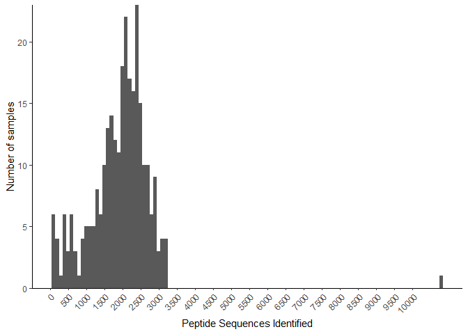
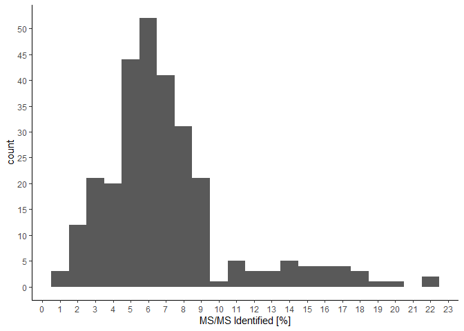

Human data process
================
Sebastián Sáenz
09/11/2020

## Dependencies

  - R version 4.0.2 (2020-06-22)
  - `tidyverse` (v . 1.3.0)

<!-- end list -->

``` r
summary_df <- read.table("data_raw/human/summary.txt",
                 header = TRUE,
                 sep = "\t",
                 check.names = FALSE)
```

``` r
summary_df %>%
  filter(!`Peptide Sequences Identified` > 30000) %>%
ggplot(aes(x =`Peptide Sequences Identified`)) +
  geom_histogram(binwidth = 100) +
  scale_x_continuous(breaks = seq(0, 10000, by = 500)) +
  ylab("Number of samples") +
  theme(axis.text.x = element_text(angle = 45))
```

<!-- -->

``` r
ggplot(data = summary_df, aes(x =`MS/MS Identified [%]` )) +
  geom_histogram(binwidth = 1) +
  scale_x_continuous(breaks = seq(0,23, by = 1)) +
  scale_y_continuous(breaks = seq(0,70, by = 5)) +
  theme_classic()
```

<!-- -->

``` r
pep_mean <- mean(summary_df$`Peptide Sequences Identified`) 
```

## My computer

``` r
sessionInfo()
```

    ## R version 4.0.2 (2020-06-22)
    ## Platform: x86_64-w64-mingw32/x64 (64-bit)
    ## Running under: Windows 10 x64 (build 18363)
    ## 
    ## Matrix products: default
    ## 
    ## locale:
    ## [1] LC_COLLATE=English_United Kingdom.1252 
    ## [2] LC_CTYPE=English_United Kingdom.1252   
    ## [3] LC_MONETARY=English_United Kingdom.1252
    ## [4] LC_NUMERIC=C                           
    ## [5] LC_TIME=English_United Kingdom.1252    
    ## 
    ## attached base packages:
    ## [1] stats     graphics  grDevices utils     datasets  methods   base     
    ## 
    ## other attached packages:
    ## [1] forcats_0.5.0   stringr_1.4.0   dplyr_1.0.2     purrr_0.3.4    
    ## [5] readr_1.3.1     tidyr_1.1.2     tibble_3.0.3    ggplot2_3.3.2  
    ## [9] tidyverse_1.3.0
    ## 
    ## loaded via a namespace (and not attached):
    ##  [1] tidyselect_1.1.0 xfun_0.16        haven_2.3.1      colorspace_1.4-1
    ##  [5] vctrs_0.3.2      generics_0.0.2   htmltools_0.5.0  yaml_2.2.1      
    ##  [9] blob_1.2.1       rlang_0.4.7      pillar_1.4.6     glue_1.4.1      
    ## [13] withr_2.2.0      DBI_1.1.0        dbplyr_1.4.4     modelr_0.1.8    
    ## [17] readxl_1.3.1     lifecycle_0.2.0  munsell_0.5.0    gtable_0.3.0    
    ## [21] cellranger_1.1.0 rvest_0.3.6      evaluate_0.14    labeling_0.3    
    ## [25] knitr_1.29       fansi_0.4.1      broom_0.7.0      Rcpp_1.0.5      
    ## [29] scales_1.1.1     backports_1.1.9  jsonlite_1.7.0   farver_2.0.3    
    ## [33] fs_1.5.0         hms_0.5.3        digest_0.6.25    stringi_1.4.6   
    ## [37] grid_4.0.2       cli_2.0.2        tools_4.0.2      magrittr_1.5    
    ## [41] crayon_1.3.4     pkgconfig_2.0.3  ellipsis_0.3.1   xml2_1.3.2      
    ## [45] reprex_0.3.0     lubridate_1.7.9  assertthat_0.2.1 rmarkdown_2.3   
    ## [49] httr_1.4.2       rstudioapi_0.11  R6_2.4.1         compiler_4.0.2
