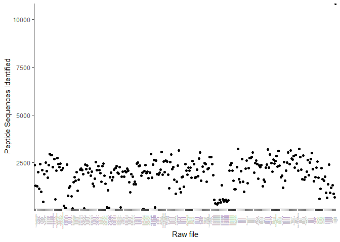
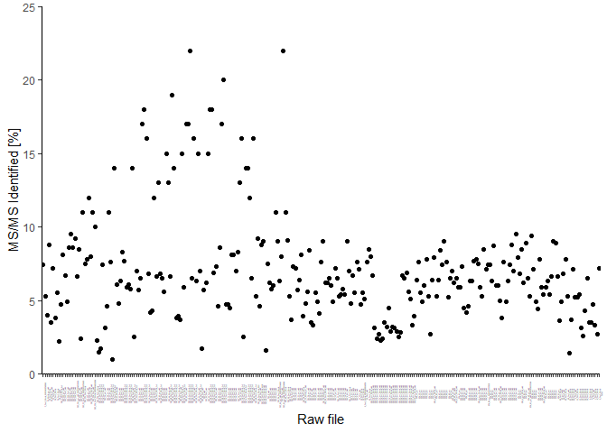
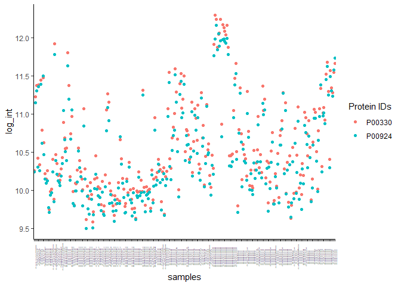
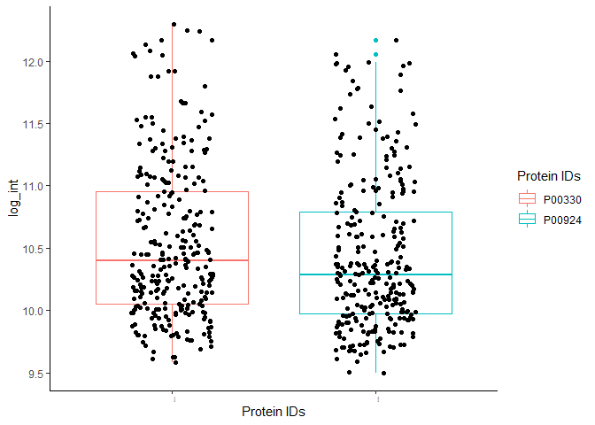
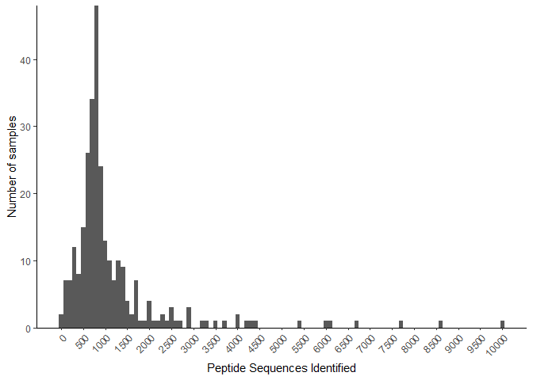
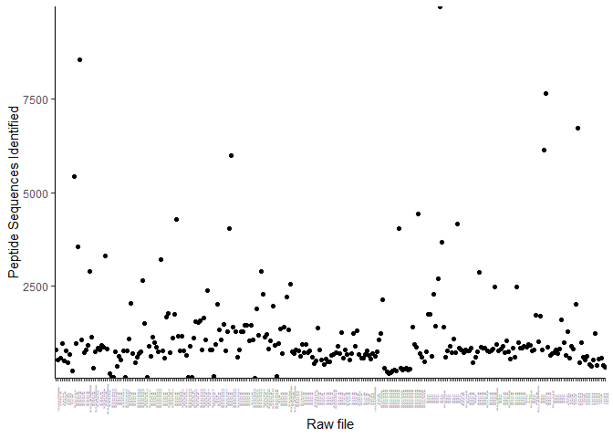
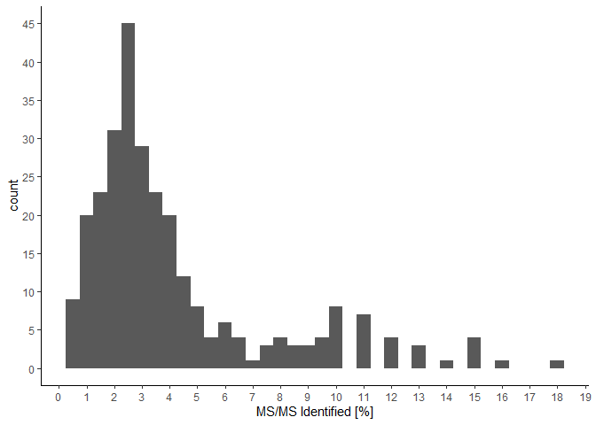
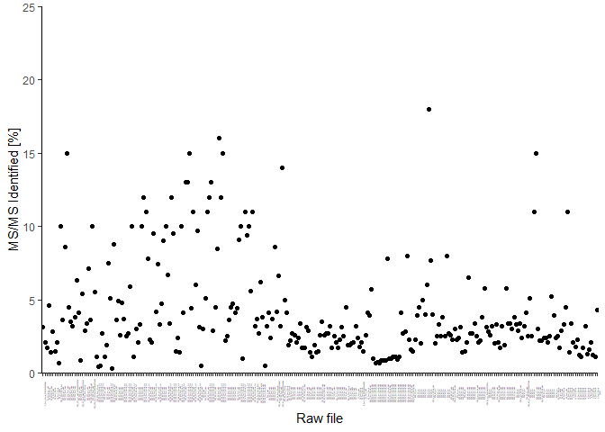
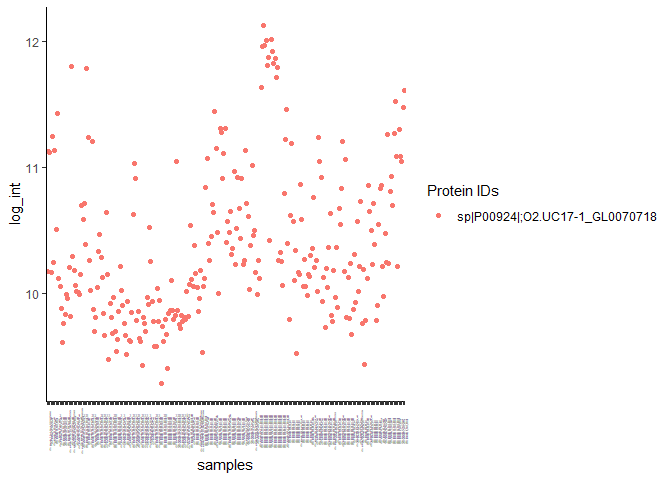
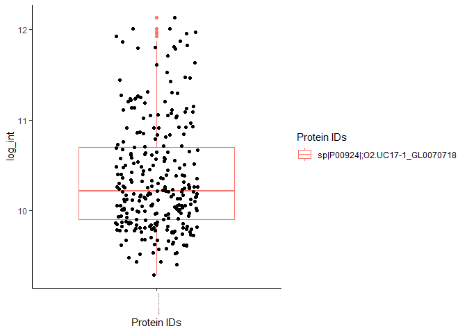

Human data processing
================
Sebastián Sáenz
09/11/2020

## Dependencies

  - R version 4.0.2 (2020-06-22)
  - `tidyverse` (v . 1.3.0)

## 1\. Human proteome

Quality control data was obtained from the `summary.txt` ouput form
MetaLab.

``` r
summary_df_human <- read.table("data_raw/human/summary.txt",
                 header = TRUE,
                 sep = "\t",
                 check.names = FALSE)
```

#### Number of peptide sequences identified

``` r
summary_df_human %>%
  filter(!`Peptide Sequences Identified` > 30000) %>%
ggplot(aes(x =`Peptide Sequences Identified`)) +
  geom_histogram(binwidth = 100) +
  scale_x_continuous(breaks = seq(0, 10000, by = 500)) +
  ylab("Number of samples") +
  scale_y_continuous(expand = c(0,0)) +
  theme_classic() +
  theme(axis.text.x = element_text(angle = 45, hjust = 1))
```

<!-- -->

``` r
summary_df_human %>%
  filter(!`Peptide Sequences Identified` > 30000) %>%
ggplot(aes(x =`Raw file`,
           y =`Peptide Sequences Identified`))+
  geom_point(stat = "identity") +
  scale_y_continuous(expand = c(0,0)) +
  theme_classic() +
  theme(axis.text.x = element_text(size = 1, angle = 90))
```

<!-- -->

Total of peptides identified:

``` r
sum(summary_df_human$`Peptide Sequences Identified`)
```

    ## [1] 543320

Summary:

``` r
summary(summary_df_human$`Peptide Sequences Identified`)
```

    ##    Min. 1st Qu.  Median    Mean 3rd Qu.    Max. 
    ##      89    1517    2050    1934    2421   10821

#### Percentage of MS/MS Identified

``` r
ggplot(data = summary_df_human, aes(x =`MS/MS Identified [%]` )) +
  geom_histogram(binwidth = 1) +
  scale_x_continuous(breaks = seq(0,23, by = 1)) +
  scale_y_continuous(breaks = seq(0,70, by = 5)) +
  theme_classic()
```

<!-- -->

``` r
summary_df_human %>%
ggplot(aes(x =`Raw file`,
           y =`MS/MS Identified [%]`))+
  geom_point(stat = "identity") +
  scale_y_continuous(expand = c(0,0), limits = c(0,25)) +
  theme_classic() +
  theme(axis.text.x = element_text(size = 1, angle = 90))
```

<!-- -->

Summary:

``` r
summary(summary_df_human$`MS/MS Identified [%]`)
```

    ##    Min. 1st Qu.  Median    Mean 3rd Qu.    Max. 
    ##   0.990   4.900   6.400   7.058   8.000  22.000

#### Standard protein

We used two proteins as standard

  - Enolase 1 [P00924](https://www.uniprot.org/uniprot/P00924)
  - Alcohol dehydrogenase 1
    [P00330](https://www.uniprot.org/uniprot/P00330)

<!-- end list -->

``` r
pg_df_human <- read.table("data_raw/human/proteinGroups_clean.txt",
                 header = TRUE,
                 sep = "\t",
                 check.names = FALSE)

pg_df_human %>%
  filter(`Protein IDs` == "P00924" | `Protein IDs` == "P00330") %>%
  pivot_longer(cols = 2:281,
               names_to = "samples",
               values_to = "Int") %>%
  mutate(log_int = log10(Int)) %>%
  ggplot(aes(x = samples,
             y = log_int,
           colour =`Protein IDs`)) +
  geom_point() +
  theme_classic() +
  theme(axis.text.x = element_text(size = 1, angle = 90))
```

<!-- -->

``` r
pg_df_human %>%
  filter(`Protein IDs` == "P00924" | `Protein IDs` == "P00330") %>%
  pivot_longer(cols = 2:281,
               names_to = "samples",
               values_to = "Int") %>%
  mutate(log_int = log10(Int)) %>%
  ggplot(aes(x = `Protein IDs`,
             y = log_int,
           colour =`Protein IDs`)) +
  geom_boxplot() +
  geom_jitter(width = 0.2, color = "black") +
  theme_classic() +
  theme(axis.text.x = element_text(size = 1, angle = 90))
```

<!-- -->

  - Enolase 1

<!-- end list -->

``` r
pg_df_human %>%
  filter(`Protein IDs` == "P00924") %>%
  pivot_longer(cols = 2:281,
               names_to = "samples",
               values_to = "Int") %>%
  summary()
```

    ##  Protein IDs          samples               Int           
    ##  Length:280         Length:280         Min.   :3.135e+09  
    ##  Class :character   Class :character   1st Qu.:9.370e+09  
    ##  Mode  :character   Mode  :character   Median :1.946e+10  
    ##                                        Mean   :9.274e+10  
    ##                                        3rd Qu.:6.185e+10  
    ##                                        Max.   :1.470e+12

  - Alcohol dehydrogenase 1

<!-- end list -->

``` r
pg_df_human %>%
  filter(`Protein IDs` == "P00330") %>%
  pivot_longer(cols = 2:281,
               names_to = "samples",
               values_to = "Int") %>%
  summary()
```

    ##  Protein IDs          samples               Int           
    ##  Length:280         Length:280         Min.   :3.814e+09  
    ##  Class :character   Class :character   1st Qu.:1.122e+10  
    ##  Mode  :character   Mode  :character   Median :2.497e+10  
    ##                                        Mean   :1.224e+11  
    ##                                        3rd Qu.:8.919e+10  
    ##                                        Max.   :1.990e+12

## 2\. Microbiome metaproteome

Quality control data was obtained from the `summary.txt` ouput form
MetaLab.

``` r
summary_df_micro <- read.table("data_raw/microbiome/summary.txt",
                 header = TRUE,
                 sep = "\t",
                 check.names = FALSE)
```

#### Number of peptide sequences identified

``` r
summary_df_micro %>%
  filter(!`Peptide Sequences Identified` > 30000) %>%
ggplot(aes(x =`Peptide Sequences Identified`)) +
  geom_histogram(binwidth = 100) +
  scale_x_continuous(breaks = seq(0, 10000, by = 500)) +
  ylab("Number of samples") +
  scale_y_continuous(expand = c(0,0)) +
  theme_classic() +
  theme(axis.text.x = element_text(angle = 45, hjust = 1))
```

<!-- -->

``` r
summary_df_micro %>%
  filter(!`Peptide Sequences Identified` > 30000) %>%
ggplot(aes(x =`Raw file`,
           y =`Peptide Sequences Identified`))+
  geom_point(stat = "identity") +
  scale_y_continuous(expand = c(0,0)) +
  theme_classic() +
  theme(axis.text.x = element_text(size = 1, angle = 90))
```

<!-- -->

Total of peptides identified:

``` r
sum(summary_df_micro$`Peptide Sequences Identified`)
```

    ## [1] 362396

Summary:

``` r
summary(summary_df_micro$`Peptide Sequences Identified`)
```

    ##    Min. 1st Qu.  Median    Mean 3rd Qu.    Max. 
    ##      32     615     792    1290    1226   38209

#### Percentage of MS/MS Identified

``` r
ggplot(data = summary_df_micro, aes(x =`MS/MS Identified [%]` )) +
  geom_histogram(binwidth = 0.5) +
  scale_x_continuous(breaks = seq(0,23, by = 1)) +
  scale_y_continuous(breaks = seq(0,70, by = 5)) +
  theme_classic()
```

<!-- -->

``` r
summary_df_micro %>%
ggplot(aes(x =`Raw file`,
           y =`MS/MS Identified [%]`))+
  geom_point(stat = "identity") +
  scale_y_continuous(expand = c(0,0), limits = c(0,25)) +
  theme_classic() +
  theme(axis.text.x = element_text(size = 1, angle = 90))
```

<!-- -->

Summary:

``` r
summary(summary_df_micro$`MS/MS Identified [%]`)
```

    ##    Min. 1st Qu.  Median    Mean 3rd Qu.    Max. 
    ##   0.320   2.100   3.000   4.155   4.700  18.000

#### Standard protein

``` r
pg_df_micro <- read.table("data_raw/microbiome/proteinGroups_clean.txt",
                 header = TRUE,
                 sep = "\t",
                 check.names = FALSE)

pg_df_micro %>%
  filter(`Protein IDs` == "sp|P00924|;O2.UC17-1_GL0070718" | `Protein IDs` == "P00330") %>%
  pivot_longer(cols = 2:281,
               names_to = "samples",
               values_to = "Int") %>%
  mutate(log_int = log10(Int)) %>%
  ggplot(aes(x = samples,
             y = log_int,
           colour =`Protein IDs`)) +
  geom_point() +
  theme_classic() +
  theme(axis.text.x = element_text(size = 1, angle = 90))
```

<!-- -->

``` r
pg_df_micro %>%
  filter(`Protein IDs` == "sp|P00924|;O2.UC17-1_GL0070718" | `Protein IDs` == "P00330") %>%
  pivot_longer(cols = 2:281,
               names_to = "samples",
               values_to = "Int") %>%
  mutate(log_int = log10(Int)) %>%
  ggplot(aes(x = `Protein IDs`,
             y = log_int,
           colour =`Protein IDs`)) +
  geom_boxplot() +
  geom_jitter(width = 0.2, color = "black") +
  theme_classic() +
  theme(axis.text.x = element_text(size = 1, angle = 90))
```

<!-- -->

  - Enolase 1 clustered with [Enolase (Slackia piriformis
    YIT 12062)](https://www.uniprot.org/blast/uniprot/B20201111A94466D2655679D1FD8953E075198DA80108F2H)

<!-- end list -->

``` r
pg_df_micro %>%
  filter(`Protein IDs` == "sp|P00924|;O2.UC17-1_GL0070718") %>%
  pivot_longer(cols = 2:281,
               names_to = "samples",
               values_to = "Int") %>%
  summary()
```

    ##  Protein IDs          samples               Int           
    ##  Length:280         Length:280         Min.   :1.941e+09  
    ##  Class :character   Class :character   1st Qu.:7.956e+09  
    ##  Mode  :character   Mode  :character   Median :1.635e+10  
    ##                                        Mean   :7.971e+10  
    ##                                        3rd Qu.:5.047e+10  
    ##                                        Max.   :1.342e+12

## My computer

``` r
sessionInfo()
```

    ## R version 4.0.2 (2020-06-22)
    ## Platform: x86_64-w64-mingw32/x64 (64-bit)
    ## Running under: Windows 10 x64 (build 18363)
    ## 
    ## Matrix products: default
    ## 
    ## locale:
    ## [1] LC_COLLATE=English_United Kingdom.1252 
    ## [2] LC_CTYPE=English_United Kingdom.1252   
    ## [3] LC_MONETARY=English_United Kingdom.1252
    ## [4] LC_NUMERIC=C                           
    ## [5] LC_TIME=English_United Kingdom.1252    
    ## 
    ## attached base packages:
    ## [1] stats     graphics  grDevices utils     datasets  methods   base     
    ## 
    ## other attached packages:
    ## [1] forcats_0.5.0   stringr_1.4.0   dplyr_1.0.2     purrr_0.3.4    
    ## [5] readr_1.3.1     tidyr_1.1.2     tibble_3.0.3    ggplot2_3.3.2  
    ## [9] tidyverse_1.3.0
    ## 
    ## loaded via a namespace (and not attached):
    ##  [1] tidyselect_1.1.0 xfun_0.16        haven_2.3.1      colorspace_1.4-1
    ##  [5] vctrs_0.3.2      generics_0.0.2   htmltools_0.5.0  yaml_2.2.1      
    ##  [9] blob_1.2.1       rlang_0.4.7      pillar_1.4.6     glue_1.4.1      
    ## [13] withr_2.2.0      DBI_1.1.0        dbplyr_1.4.4     modelr_0.1.8    
    ## [17] readxl_1.3.1     lifecycle_0.2.0  munsell_0.5.0    gtable_0.3.0    
    ## [21] cellranger_1.1.0 rvest_0.3.6      evaluate_0.14    labeling_0.3    
    ## [25] knitr_1.29       fansi_0.4.1      broom_0.7.0      Rcpp_1.0.5      
    ## [29] scales_1.1.1     backports_1.1.9  jsonlite_1.7.0   farver_2.0.3    
    ## [33] fs_1.5.0         hms_0.5.3        digest_0.6.25    stringi_1.4.6   
    ## [37] grid_4.0.2       cli_2.0.2        tools_4.0.2      magrittr_1.5    
    ## [41] crayon_1.3.4     pkgconfig_2.0.3  ellipsis_0.3.1   xml2_1.3.2      
    ## [45] reprex_0.3.0     lubridate_1.7.9  assertthat_0.2.1 rmarkdown_2.3   
    ## [49] httr_1.4.2       rstudioapi_0.11  R6_2.4.1         compiler_4.0.2
